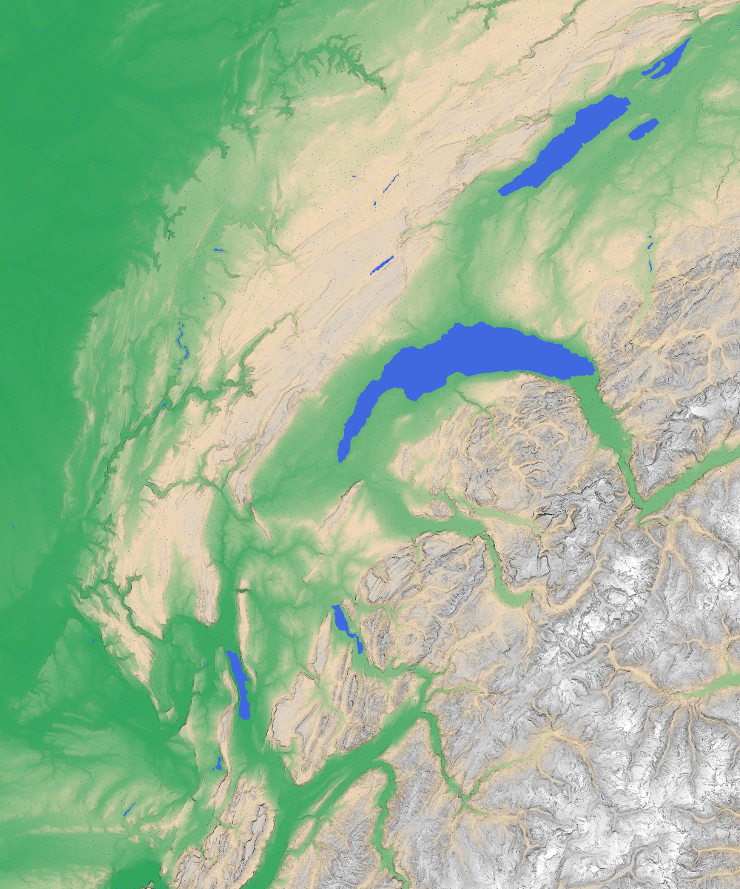
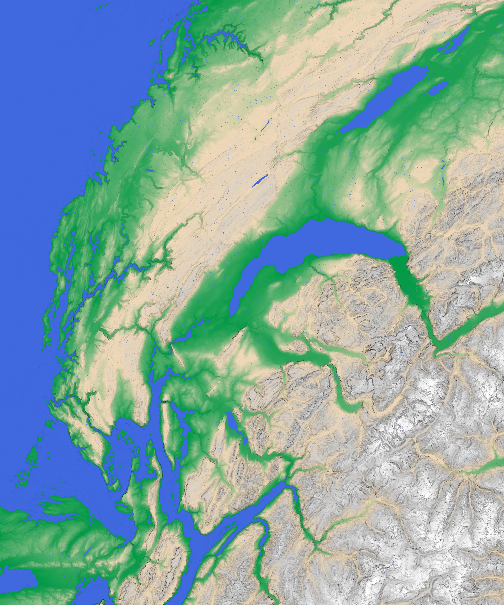

# VTK - Labo 2 - Carte topographique en relief

Le but de ce laboratoire est de générer une carte topographique en couleur et en relief à partir des données altimétriques brutes. Ces données sont fournies en annexe sous la forme d'un fichier texte contenant 3001 x 3001 altitudes (en mètres) échantillonnant de manière régulière la zone comprise entre 45 et 47.5 degrés de latitude nord, et 5 et 7.5 degrés de longitude est.

## Utilisation

Pour générer le dataset au format VTK, il faut exécuter le programme `txt2vtk.py`:

```bash
python txt2vtk.py altitudes.txt altitudes.vtk
```

Pour générer la carte topographique, il faut exécuter le programme `main.py`:

```bash
python main.py
```

Ce programme générera deux images:

- `output_level_standard.png`: carte topographique avec le niveau de la mer comme défini dans la valeur `INTERACTIVE_LEVEL_SEA`. Ici le niveau de la mer est défini à 0 mètres.

- `output_level_xxx.png`: carte topographique avec le niveau de la mer à XXX mètre comme défini dans la fonction `main`. Ici le niveau de la mer est défini à 370 mètres.

La fenêtre interactive s'ouvrira en affichant la carte avec le niveau de la mer défini par la valeur de `INTERACTIVE_LEVEL_SEA`.

## Résultats

Voici un exemple des deux cartes générées:



